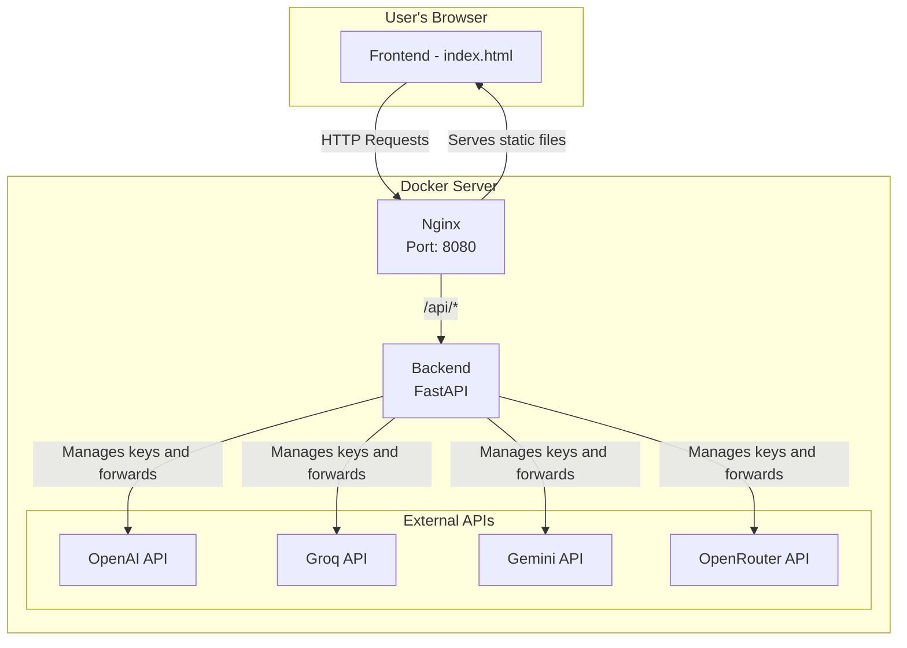

# Study Guide Pro (Microservices Architecture)

Study Guide Pro is a powerful, AI-driven study guide generator, now refactored into a robust, secure, and production-ready microservices architecture. The application allows users to create, manage, and interact with custom learning paths on any subject, leveraging the power of multiple LLM providers securely.

This version has been rewritten from the ground up to separate responsibilities, enhance security, and simplify deployment.

---

## Application Architecture

The new architecture consists of two main services, orchestrated with Docker Compose:

1.  **Frontend**: A static application (HTML/CSS/JS) served by a high-performance Nginx server. The Nginx server also acts as a reverse proxy to the backend, ensuring all API communications pass through it.
2.  **Backend**: A secure API gateway built with Python and FastAPI. It manages API keys, processes requests from the frontend, and interacts with different language model providers (OpenAI, Groq, etc.).

### Architecture Diagram



---

## Key Improvements in the New Version

-   **Enhanced Security**: The API key is no longer exposed in the browser. All key management is handled by the backend, which reads them from secure environment variables.
-   **Multi-Provider Support**: Easily select between OpenAI, Groq, Gemini, or OpenRouter from the user interface.
-   **Scalable Architecture**: The separation of frontend and backend allows each service to be scaled independently.
-   **Simplified Deployment**: With Docker and Docker Compose, the entire application can be started with a single command, ensuring a consistent development and production environment.
-   **No CORS Issues**: The Nginx reverse proxy eliminates the need for complex Cross-Origin Resource Sharing (CORS) configurations.

---

## Getting Started (Setup)

To run the project, you will need **Docker** and **Docker Compose** installed on your machine.

### 1. Clone the Repository

```bash
git clone https://github.com/YOUR_USERNAME/YOUR_REPOSITORY.git
cd YOUR_REPOSITORY
```

### 2. Configure API Keys

The backend requires API keys to communicate with the LLM providers. The `docker-compose.yml` file is set up to receive them as environment variables.

Create a file named `.env` in the project root. This file **should not** be committed to version control.

```
# .env
# Add the API keys for the providers you intend to use.
# You don't need to fill them all, only the ones you will use.

OPENAI_API_KEY="sk-..."
GROQ_API_KEY="gsk_..."
GEMINI_API_KEY="..."
OPENROUTER_API_KEY="..."
```

Docker Compose will automatically load the variables from this file.

### 3. Build and Start the Containers

With Docker running, execute the following command in the project root:

```bash
docker compose up --build -d
```

-   `--build`: Forces the rebuild of the Docker images, ensuring the latest code changes are applied.
-   `-d`: Runs the containers in "detached" mode (in the background).

### 4. Access the Application

Once the build process is complete, the application will be available in your browser at the following address:

[**http://localhost:8080**](http://localhost:8080)

---

## Application Usage

1.  **Access the App**: Open [http://localhost:8080](http://localhost:8080).
2.  **Go to Settings**:
    -   Click on "Settings" in the navigation bar.
    -   **Select the API Provider** that you configured in the `.env` file.
    -   **Enter the Model** corresponding to the provider (e.g., `gpt-4o-mini` for OpenAI, `llama3-8b-8192` for Groq).
    -   Save the settings.
3.  **Create Your Guide**:
    -   Navigate back to "My Guides" and click "Create New Guide."
    -   The application will use the configured provider and model to generate the content.

The rest of the features, such as lesson generation, Q&A, exporting, and audio downloads, work the same as in the previous version.

---

## Stopping the Application

To stop the containers, run the following command in the project root:

```bash
docker compose down
```

## Author & Contact

-   **Jailton Fonseca**
-   **Location**: Brazil
-   **YouTube**: [www.youtube.com/@JailtonFonseca](https://www.youtube.com/@JailtonFonseca)
