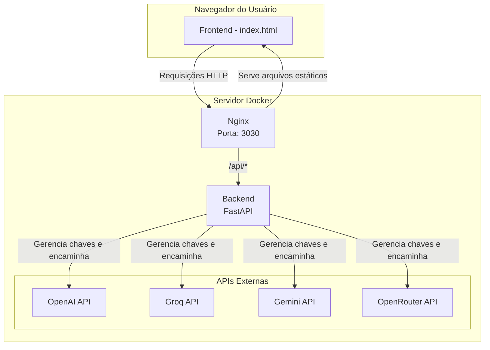

# Guia de Estudo Pro (Arquitetura de Microsserviços)

O Guia de Estudo Pro é uma poderosa aplicação geradora de guias de estudo, agora refatorada para uma arquitetura de microsserviços robusta, segura e pronta para produção. A aplicação permite que os usuários criem, gerenciem e interajam com trilhas de aprendizado personalizadas sobre qualquer assunto, aproveitando o poder de múltiplos provedores de LLM de forma segura.

Esta versão foi reescrita do zero para separar as responsabilidades, aumentar a segurança e facilitar a implantação.

---

## Arquitetura da Aplicação

A nova arquitetura é composta por dois serviços principais, orquestrados com Docker Compose:

1.  **Frontend**: Uma aplicação estática (HTML/CSS/JS) servida por um Nginx de alta performance. O Nginx também atua como um proxy reverso para o backend, garantindo que todas as comunicações com a API passem por ele.
2.  **Backend**: Um gateway de API seguro construído com Python e FastAPI. Ele gerencia as chaves de API, processa as solicitações do frontend e interage com os diferentes provedores de modelos de linguagem (OpenAI, Groq, etc.).

### Diagrama da Arquitetura



---

## Principais Melhorias da Nova Versão

-   **Segurança Reforçada**: A chave de API não fica mais exposta no navegador. Todo o gerenciamento é feito no backend, que a lê de variáveis de ambiente seguras.
-   **Suporte a Múltiplos Provedores**: Selecione facilmente entre OpenAI, Groq, Gemini ou OpenRouter na interface do usuário.
-   **Arquitetura Escalável**: A separação entre frontend e backend permite que cada serviço seja escalado de forma independente.
-   **Implantação Simplificada**: Com Docker e Docker Compose, a aplicação inteira pode ser iniciada com um único comando, garantindo um ambiente de desenvolvimento e produção consistente.
-   **Sem Problemas de CORS**: O Nginx atua como um proxy reverso, eliminando a necessidade de configurações complexas de CORS.

---

## Como Começar (Setup)

Para executar o projeto, você precisará ter o **Docker** e o **Docker Compose** instalados em sua máquina.

### 1. Clone o Repositório

```bash
git clone https://github.com/SEU_USUARIO/SEU_REPOSITORIO.git
cd SEU_REPOSITORIO
```

### 2. Configure as Chaves de API

O backend precisa das chaves de API para se comunicar com os provedores de LLM. O `docker-compose.yml` está preparado para recebê-las como variáveis de ambiente.

Você tem duas opções flexíveis para configurar as chaves. **Você só precisa usar uma delas.**

**Opção 1 (Recomendada): Gerenciar pela Interface do App**

A maneira mais fácil é configurar as chaves diretamente na interface da aplicação após a inicialização.

1.  Primeiro, inicie o aplicativo (instruções na próxima seção).
2.  Acesse a aplicação no seu navegador.
3.  Vá para a página **Configurações**.
4.  Na seção **Gerenciamento de Chaves de API**, você pode adicionar, visualizar e remover as chaves para cada provedor. As chaves são armazenadas de forma segura em um arquivo `api_keys.json` no backend.

**Opção 2: Usar Variáveis de Ambiente (Arquivo `.env`)**

Se preferir, você pode continuar usando o método tradicional com um arquivo `.env`.

Crie um arquivo chamado `.env` na raiz do projeto.

```
# .env - Exemplo
OPENAI_API_KEY="sk-..."
GROQ_API_KEY="gsk_..."
```

> **Nota**: As chaves definidas na interface do aplicativo (Opção 1) terão prioridade sobre as definidas no arquivo `.env`.

### 3. Construa e Inicie os Contêineres

Com o Docker em execução, torne o script de inicialização executável (apenas na primeira vez) e execute-o:

```bash
chmod +x start.sh
./start.sh
```

O script `start.sh` irá automaticamente:
-   Verificar se a porta padrão (`3030`) está em uso.
-   Se estiver ocupada, ele encontrará a próxima porta livre (ex: `3031`).
-   Construir e iniciar os contêineres da aplicação.
-   Informar no terminal o endereço exato para acessar a aplicação.

### 4. Acesse a Aplicação

Após a execução do script, o terminal mostrará uma mensagem indicando o endereço para acessar o aplicativo, como:

`Acesse em: http://localhost:3030` (ou a porta que foi encontrada)

---

## Uso da Aplicação

1.  **Acesse a Aplicação**: Abra [http://localhost:3030](http://localhost:3030).
2.  **Vá para as Configurações**:
    -   Clique em "Configurações" na barra de navegação.
    -   **Selecione o Provedor de API** que você configurou no arquivo `.env`.
    -   **Informe o Modelo** correspondente ao provedor (ex: `gpt-4o-mini` para OpenAI, `llama3-8b-8192` para Groq).
    -   Salve as configurações.
3.  **Crie seu Guia**:
    -   Volte para "Meus Guias" e clique em "Criar Novo Guia".
    -   A aplicação usará o provedor e modelo configurados para gerar o conteúdo.

O restante dos recursos, como a geração de aulas, perguntas, exportação e download de áudio, funciona da mesma forma que na versão anterior.

---

## Parando a Aplicação

Para parar os contêineres, execute o seguinte comando na raiz do projeto:

```bash
docker compose down
```

## Autor e Contato

-   **Jailton Fonseca**
-   **Localização**: Brasil
-   **YouTube**: [www.youtube.com/@JailtonFonseca](https://www.youtube.com/@JailtonFonseca)
